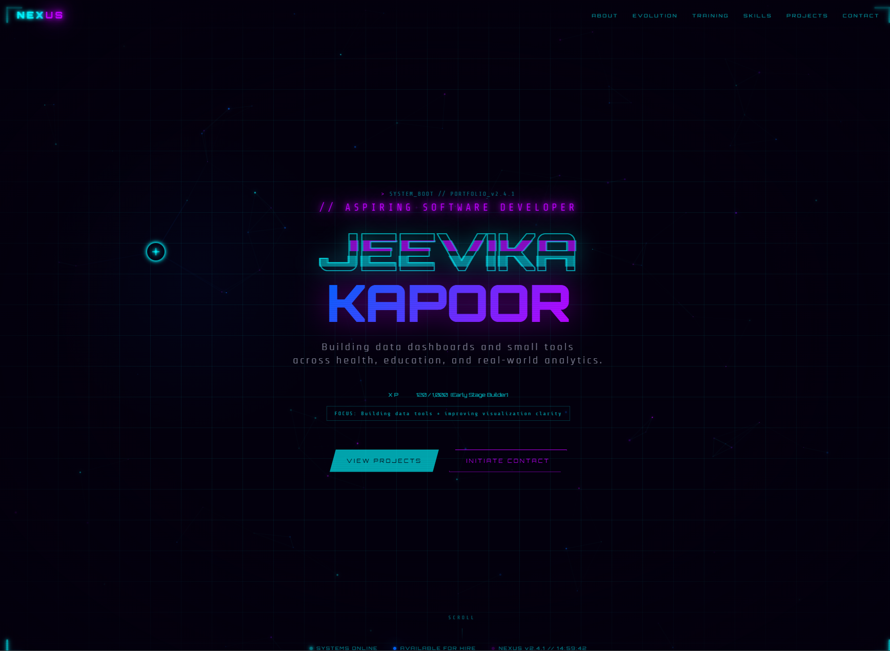

#  Portfolio — Jeevika Kapoor  

<p align="center">
  <a href="https://jk3690.github.io">
    
  </a>
  
  
  
</p>

---

## // PORTFOLIO

A **sci-fi themed developer portfolio** built as part of the **YIIC Internship 7.0 (Scaler School)**.

Designed to showcase:
- 📊 Data-driven projects  
- 🧩 Problem-solving approach  
- ⚙️ Clean UI built from scratch  

---

## 🖼 Preview

<p align="center">
  
</p>

---

## ⚙️ CORE FEATURES

| Feature | Description |
|--------|------------|
| ⚡ Sci-fi UI System | Neon, futuristic interface |
| 📊 Project Showcase | Real-world data analysis tools |
| 🧬 Evolution Timeline | Learning journey |
| 📈 Skill Indicators | Visual progress representation |
| 🎯 Gamified XP | Early-stage builder progression |
| 🧩 Modular Layout | Clean, section-based design |

---

## 🛠 TECH STACK

<p align="center">
  
</p>

### 🌐 Portfolio
- HTML, CSS  

### 📊 Projects
- Python  
- Matplotlib  

---

## 📂 PROJECTS

### 🔹 Mind Over Data
> Analyzed student mental health patterns to identify links between academics and stress.

### 🔹 Pandemic Decoded
> Built a data exploration tool to filter and visualize COVID-19 trends.

### 🔹 Synthwave Portfolio
> Designed an experimental UI-driven portfolio interface.

### 🔹 CycleCare *(In Progress)*
> Developing a women’s health tracking system using AppSheet.

---

## 📈 CURRENTLY WORKING ON
```text
→ Improving data visualization clarity  
→ Structuring Python projects better  
→ Learning API fundamentals  
→ Building consistent GitHub workflow
```
---

## 🤖 AI USAGE 
This project was partially developed using AI tools (Replit AI).
AI-assisted development was encouraged as part of the YIIC Internship requirement.

How it was used:
- Debugging HTML/CSS
- Structuring UI components
- Refining code

All project ideas, structure, and decisions were directed and customized by me.

---

##  CONNECT

<p align="center"> <a href="https://www.linkedin.com/in/jeevika-kapoor-a8a2023b0/">  </a> <a href="https://github.com/JK3690">  </a> </p>

---

## FINAL NOTE

This portfolio reflects my current stage as a developer.
It is continuously evolving as I learn, build, and improve.
